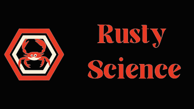

## Summary
An easy to use and learn ML toolkit for Rust
## Features

- **Simple and intuitive API** for common Machine Learning tasks.
- Implementations of popular algorithms like **K-Nearest Neighbors** and **Decision Trees**.
- Support for **classification**, **regression**, and **clustering**.
- Utility functions for data manipulation and metrics evaluation.
- Includes sample datasets like **Iris**, **Housing**, and **Breast Cancer** for quick experimentation.

## Installation

Add Rusty Science to your `Cargo.toml` dependencies:

```toml
[dependencies]
rusty_science = "0.1.0-alpha"
```

### Usage
```rust
use rusty_science::classification::KNNClassifier;
use rusty_science::data::load_iris;

fn main() {
    let iris_data = load_iris();
    let (data, labels) = iris_data.to_numerical_labels();

    let target = vec![1.5, 1.5, 1.5, 1.5];

    let n_neighbors = 3;
    let knn = KNNClassifier::<f64, i64>::new(n_neighbors);
    knn.fit(data, labels);
    let prediction = knn.predict(target);
}

```


### Note: This crate is a work in progress and features are subject to change

## Implementation table

### Features:

| Feature                                  | Implemented?       |
|:-----------------------------------------|--------------------|
| KNNClassifier                            | ✅ Implemented      |                     |
| KNNRegression                            | ✅ Implemented      |
| KNNCluster                               | ✅ Implemented      |
| Decision Tree Regression                 | ✅ Implemented      |
| Decision tree Classifier                 | ✅ Implemented      |
| Perceptron                               | ✅ Implemented      |
| MLP Classifier                           | ❌ Not Implemented  |
| MLP Regression                           | ❌ Not Implemented  |
| Linear Regression                        | ✅ Implemented      |
| Data Functions (train-test split)        | ✅ Train test split |
| Dummy Datasets                           | ✅ Implemented      |
| Graphing - Integrate the plotters crate? | ❌ Not Implemented  |
| Binary SVC                               | ✅ Implemented      |
| SVR                                      | 🚧 Not Implemented |
| DBSCAN clustering                        | 🚧 In Progress     |
| Gaussian Mixture Model                   | ❌ Not Implemented  |
| BIRCH algorithm                          | ❌ Not Implemented  |
| Lasso Regression                         | ❌ Not Implemented  |
| PCA                                      | ❌ Not Implemented  |
| Ridge Regression                         | ❌ Not Implemented  |
| ElasticNet                               | ❌ Not Implemented  |
| Lars                                     | ❌ Not Implemented  |

### Metrics:


| Metric    | Implemented       |
|-----------|-------------------|
| Accuracy  | ✅ Implemented     |
| r2        | ✅ Implemented     |
| MAE       | ✅ Implemented     |
| MSE       | ❌ Not Implemented |
| Precision | ❌ Not Implemented |

### Datasets:

| Dataset      | Implemented   |
|--------------|---------------|
| Iris         | ✅ Implemented |
| Housing      | ✅ Implemented |
| Brest Cancer | ✅ Implemented |


## Contact
If you want to contact us email us at cooper.brown197@gmail.com or jack.welsh@drake.edu